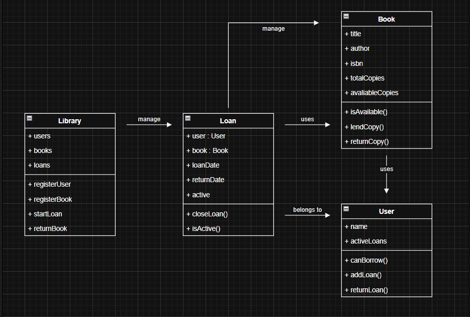
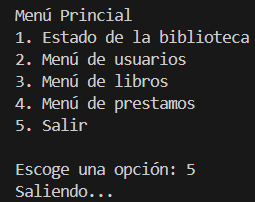

# Avance del reto
[Volver al inicio](https://github.com/diegojimdel47/DFS-avance)
## Diagrama

## Explicación del diseño
En este programa contamos con cuatro clases:
- Library

    Es el sistema principal de la biblioteca, básicamente administra a los usuarios, los libros y los préstamos, permite registrar nuevos libros y usuarios, iniciar préstamos y gestionar su devolución.
- Book

    Esta clase representa a un libro dentro de la biblioteca, contiene su información básica y se encarga de controlar si un libro esta dispoible para un préstamo, y si una copia ya ha sido prestada o devuelta.
- User

    Aquí se representa a un usuario de la biblioteca, se almacena su información básica como con los libros y lleva control de sus préstamos activos, además puede verificar si el usuario es apto para solicitar otro préstamo.
- Loan

    Por último esta clase representa el préstamo de un libro a un usuario, actuando de intermediario, almacena información como la fecha del préstamo o la de devolución, y el estado del mismo.
## Código del menú de inicio
```java
import java.util.Scanner;
public class avance_reto {
    public static void main(String[] args) {
        Scanner sc = new Scanner(System.in);
        int opt;

        do {

            System.out.println("Sistema de gestión de biblioteca");
            System.out.println("\nMenú Princial");
            System.out.println("1. Estado de la biblioteca");
            System.out.println("2. Menú de usuarios");
            System.out.println("3. Menú de libros");
            System.out.println("4. Menú de prestamos");
            System.out.println("5. Salir");

            System.out.print("\nEscoge una opción: ");
            opt = sc.nextInt();

            switch(opt) {
                case 1: 
                    System.out.println("Estado de la biblioteca en proceso de creación...");
                    break;
                case 2:
                    System.out.println("Menú de usuarios en proceso de creación...");
                    break;
                case 3:
                    System.out.println("Menú de libros en proceso de creación...");
                    break;
                case 4:
                    System.out.println("Menú de prestamos en proceso de creación...");
                    break;
                case 5:
                    System.out.println("Saliendo...");
                    break;
                default:
                    System.out.println("Opción inválida, por favor intenta otra vez.");
            }
        }while(opt != 5);
    }
}
```
Salida:

